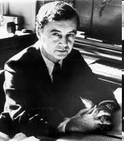

# Ervin Goffman
 - Les interaction
 - regles d'interaction
 - Roles sociaux
 - Identité d'apparence
 - L'espace social est un  theatre

## Les régles d'interaction
 - Il faut présevé sa face et celle de l'autre
 > Ne pas perdre la face.

 - Regles de tenue
 - Rite d'évitement

## La face
Selon Erving Goffman, la face est la valeur sociale positive qu'une personne revendique effectivement à travers une ligne d'action que les autres supposent qu'elle a adoptée au cours d'un contact particulier (Les Rites d'interaction 1967).
